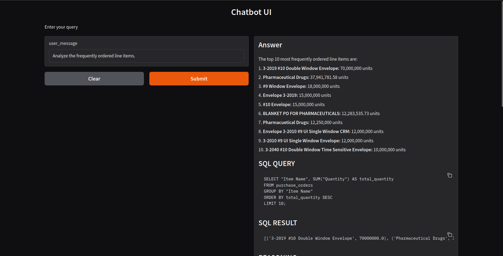

# ai-engineer-assessment-penny

## Setting up
This project is using `uv` for package management.
To install it on linux, run the following commands:
```sh
wget -qO- https://astral.sh/uv/install.sh | sh
echo 'eval "$(uv generate-shell-completion bash)"' >> ~/.bashrc
source ~/.bashrc 
```
Or check out the docs: https://docs.astral.sh/uv/getting-started/installation

### Install Dependencies
After you clone the repo, run:
```sh
uv sync
```

### Set up environment variables
Copy the example env file and add your api keys and connection details:
```sh
cp .env.example .env
```

### Load the data
To load the data into a mongodb cluster, run the following:
```sh
uv run --env-file .env -m scripts.load_to_mongodb
```
This will download the data from kaggle, extract it and load it into the mongodb server.


To load the data into a sqlite database (needed to use the chatbot), run the following command:
```sh
uv run --env-file .env -m scripts.load_to_sqlite
```
This will create a sqlite database from the data that will be used by the LLM to answer the user queries.

### Run the chatbot app

```sh
uv run --env-file .env -m src.main
```
This will run a webapp at http://127.0.0.1:7860/ where we can interact with the chatbot.
